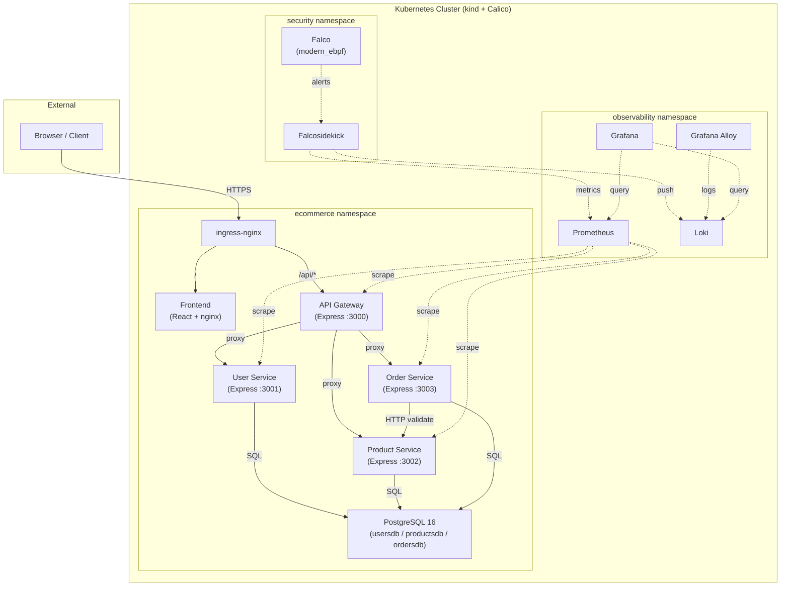
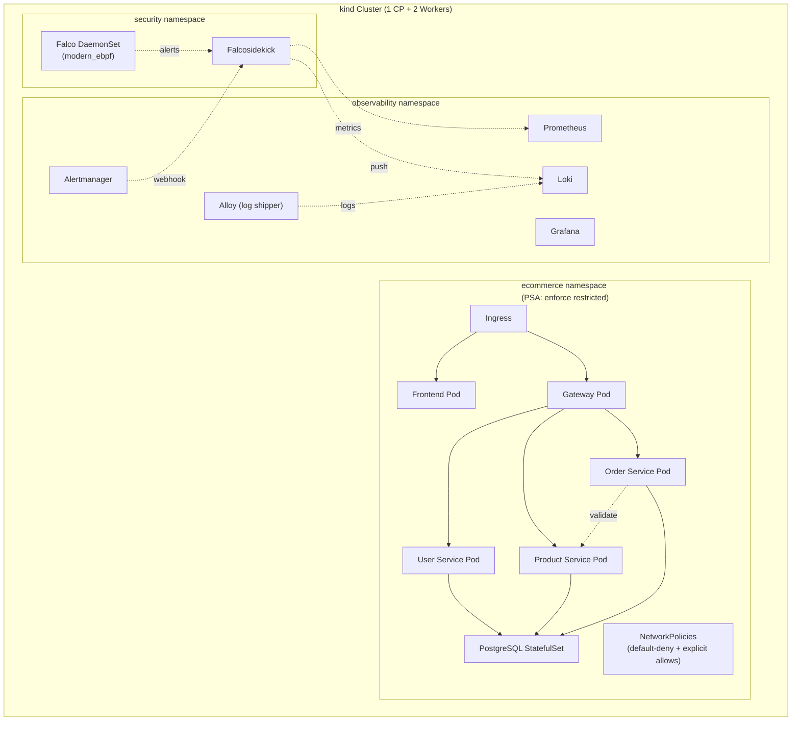
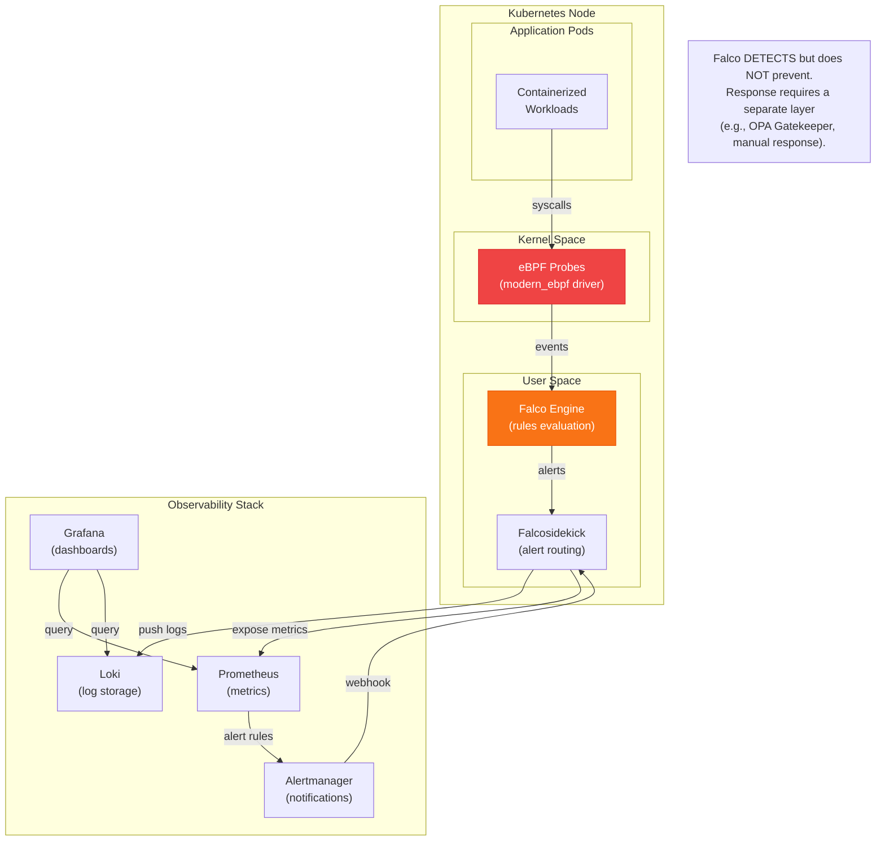

# Architecture Document — secure-devsecops-platform

## 1. System Context

**secure-devsecops-platform** is a containerized e-commerce microservices
application designed to demonstrate enterprise-grade DevSecOps practices. The
business logic is intentionally simple — a basic online store with user
registration, product catalogue, and order placement — so that all engineering
depth goes into:

- Security-gated CI/CD pipelines
- Container hardening and supply-chain security
- Kubernetes workload hardening and network microsegmentation
- Runtime intrusion detection
- Full-stack observability

### Deployment Target

The **real, permanent deployment target** is a local Kubernetes cluster
provisioned via **kind** (Kubernetes IN Docker) with **Calico** as the CNI
plugin. Calico is mandatory because kind's default CNI (kindnet) does not
enforce NetworkPolicy — and NetworkPolicy enforcement is a core security
control in this project.

> **Optional Cloud Extension:** An AWS deployment architecture (EKS, ECR,
> VPC, IAM-OIDC) is documented under `terraform/optional-aws/` as evidence
> of cloud competency, but it is never applied or provisioned in the mandatory
> project. See [ADR-0001](adr/0001-technology-choices.md) for rationale.

---

## 2. Component Descriptions

### 2.1 Frontend (React 18 + Vite 5)

- **Port:** 8080 (via nginx)
- **Purpose:** Static SPA served by a hardened nginx container. Handles user
  registration, login, product browsing, and order placement.
- **Security:** nginx configured with `server_tokens off`, CSP, X-Frame-Options,
  X-Content-Type-Options, Referrer-Policy. Runs as non-root (UID 10001).

### 2.2 API Gateway (Express)

- **Port:** 3000
- **Purpose:** Single entry point for all client requests. Verifies JWTs,
  applies rate limiting (`express-rate-limit`), sets security headers (`helmet`),
  and proxies requests to backend services.
- **Security:** JWT verification, CORS allowlist, rate limiting (stricter on
  `/login`), never exposes internal service topology to clients.

### 2.3 User Service (Express)

- **Port:** 3001
- **Database:** `usersdb` (accessed via `user_svc` role only)
- **Purpose:** User registration and authentication. Issues JWTs (HS256, 15-min
  expiry, `iss` + `aud` claims).
- **Endpoints:** `POST /register`, `POST /login`, `GET /me`, `GET /health`,
  `GET /ready`
- **Security:** bcrypt cost factor 12, parameterised SQL, zod input validation.

### 2.4 Product Service (Express)

- **Port:** 3002
- **Database:** `productsdb` (accessed via `product_svc` role only)
- **Purpose:** Product catalogue management.
- **Endpoints:** `GET /products`, `GET /products/:id`, `POST /products` (admin),
  `PATCH /products/:id/stock` (internal), `GET /health`, `GET /ready`
- **Security:** Admin-only creation, internal-only stock updates.

### 2.5 Order Service (Express)

- **Port:** 3003
- **Database:** `ordersdb` (accessed via `order_svc` role only)
- **Purpose:** Order placement and retrieval. Calls product-service over HTTP
  to validate price and stock before creating an order.
- **Endpoints:** `POST /orders`, `GET /orders`, `GET /orders/:id`,
  `GET /health`, `GET /ready`
- **Security:** User can only access their own orders. Cross-service call
  validates data integrity.

### 2.6 PostgreSQL 16

- **Port:** 5432
- **Purpose:** One instance hosting three logical databases (`usersdb`,
  `productsdb`, `ordersdb`) with **three separate DB roles**, each granted
  access only to its own database. Cross-database access must fail — this is
  a demonstrable security control.

---

## 3. Data Flow Diagram with Trust Boundaries

```
┌─────────────────────────────────────────────────────────────────┐
│                    TRUST BOUNDARY: Internet                     │
│                                                                 │
│   ┌──────────┐                                                  │
│   │  Browser  │                                                 │
│   └────┬─────┘                                                  │
│        │ HTTPS                                                  │
├────────┼────────────────────────────────────────────────────────┤
│        │           TRUST BOUNDARY: Kubernetes Ingress           │
│   ┌────▼─────┐                                                  │
│   │  Ingress  │  ingress-nginx                                  │
│   │Controller │                                                 │
│   └──┬────┬──┘                                                  │
│      │    │                                                     │
│  ┌───▼┐ ┌─▼───────┐                                            │
│  │ FE │ │   API   │                                             │
│  │nginx│ │Gateway  │  JWT verify + rate limit + helmet          │
│  └────┘ └──┬──┬──┬┘                                            │
├────────────┼──┼──┼──────────────────────────────────────────────┤
│            │  │  │  TRUST BOUNDARY: Internal Services           │
│    ┌───────▼┐ │ ┌▼────────┐                                     │
│    │ User   │ │ │ Order   │                                     │
│    │Service │ │ │ Service │──HTTP──┐                             │
│    └───┬────┘ │ └────┬────┘       │                             │
│        │      │      │        ┌───▼────────┐                    │
│        │   ┌──▼──────┴─┐      │  Product   │                    │
│        │   │           │      │  Service   │                    │
│        │   │           │      └──────┬─────┘                    │
├────────┼───┼───────────┼─────────────┼──────────────────────────┤
│        │   │  TRUST BOUNDARY: Data   │                          │
│    ┌───▼───▼───────────▼─────────────▼───┐                      │
│    │          PostgreSQL 16              │                       │
│    │  ┌────────┐ ┌──────────┐ ┌────────┐ │                      │
│    │  │usersdb │ │productsdb│ │ordersdb│ │                      │
│    │  │(user_  │ │(product_ │ │(order_ │ │                      │
│    │  │ svc)   │ │  svc)    │ │ svc)   │ │                      │
│    │  └────────┘ └──────────┘ └────────┘ │                      │
│    └─────────────────────────────────────┘                      │
└─────────────────────────────────────────────────────────────────┘
```

---

## 4. Mermaid Diagrams

### 4.1 High-Level Architecture



### 4.2 Application Flow (Register → Login → Order)

```mermaid
sequenceDiagram
    participant C as Client
    participant GW as API Gateway
    participant US as User Service
    participant PS as Product Service
    participant OS as Order Service
    participant DB as PostgreSQL

    Note over C,DB: Registration Flow
    C->>GW: POST /api/users/register
    GW->>US: POST /register (rate limited)
    US->>DB: INSERT INTO users (bcrypt hash)
    DB-->>US: user created
    US-->>GW: 201 {id, email}
    GW-->>C: 201 {id, email}

    Note over C,DB: Login Flow
    C->>GW: POST /api/users/login
    GW->>US: POST /login (stricter rate limit)
    US->>DB: SELECT user by email
    US->>US: bcrypt.compare(password, hash)
    US->>US: sign JWT (HS256, 15min, iss+aud)
    US-->>GW: 200 {token}
    GW-->>C: 200 {token}

    Note over C,DB: Order Flow
    C->>GW: POST /api/orders {productId, qty}<br/>Authorization: Bearer <JWT>
    GW->>GW: verify JWT (iss, aud, exp, signature)
    GW->>OS: POST /orders + x-user-id header
    OS->>PS: GET /products/:id (validate price+stock)
    PS->>DB: SELECT product
    PS-->>OS: {price, stock}
    OS->>OS: validate stock >= qty
    OS->>DB: INSERT INTO orders
    OS->>PS: PATCH /products/:id/stock (decrement)
    PS->>DB: UPDATE products SET stock = stock - qty
    OS-->>GW: 201 {order}
    GW-->>C: 201 {order}
```



### 4.3 CI/CD Pipeline

```mermaid
flowchart LR
    subgraph "Stage 1: Code Quality"
        Lint["Lint<br/>(ESLint)"]
        Test["Unit Tests<br/>(Jest + Coverage)"]
    end

    subgraph "Stage 2: Security Scanning"
        SAST["SAST<br/>(Semgrep)"]
        Secrets["Secret Scan<br/>(Gitleaks)"]
        SCA["SCA<br/>(npm audit + OSV)"]
    end

    subgraph "Gate 1"
        G1{{"Security<br/>Gate 1"}}
    end

    subgraph "Stage 3: Build & Scan"
        Build["Docker Build<br/>(BuildKit)"]
        Trivy["Image Scan<br/>(Trivy)"]
        SBOM["SBOM<br/>(Syft)"]
    end

    subgraph "Gate 2"
        G2{{"Security<br/>Gate 2"}}
    end

    subgraph "Stage 4: Publish"
        Push["Push to<br/>ghcr.io"]
        Sign["Cosign<br/>Sign"]
        DAST["DAST<br/>(ZAP)"]
    end

    subgraph "Gate 3"
        G3{{"Security<br/>Gate 3"}}
    end

    subgraph "Stage 5: Deploy"
        Verify["Cosign<br/>Verify"]
        Deploy["Deploy to<br/>kind + Calico"]
        Smoke["Smoke<br/>Tests"]
    end

    Lint --> Test --> SAST --> Secrets --> SCA --> G1
    G1 -->|pass| Build --> Trivy --> SBOM --> G2
    G2 -->|pass| Push --> Sign --> DAST --> G3
    G3 -->|pass| Verify --> Deploy --> Smoke

    style G1 fill:#f59e0b,stroke:#d97706,color:#000
    style G2 fill:#f59e0b,stroke:#d97706,color:#000
    style G3 fill:#f59e0b,stroke:#d97706,color:#000
```



### 4.4 Kubernetes Namespace Layout



### 4.5 Runtime Security Architecture



---

## 5. Repository Structure

```
secure-devsecops-platform/
├── src/
│   ├── frontend/              # React 18 + Vite 5 SPA
│   │   ├── src/
│   │   ├── public/
│   │   └── nginx/             # Hardened nginx.conf
│   ├── api-gateway/           # Express API gateway (:3000)
│   │   └── src/
│   │       ├── middleware/     # JWT verify, rate limit, helmet
│   │       └── routes/        # Proxy routes
│   ├── user-service/          # Express (:3001) — auth + JWT
│   │   └── src/
│   │       ├── middleware/
│   │       ├── routes/
│   │       └── models/
│   ├── product-service/       # Express (:3002) — catalogue
│   │   └── src/
│   │       ├── middleware/
│   │       ├── routes/
│   │       └── models/
│   └── order-service/         # Express (:3003) — orders
│       └── src/
│           ├── middleware/
│           ├── routes/
│           └── models/
├── db/
│   ├── init/                  # SQL: databases, roles, schemas
│   └── migrations/
├── docker/
│   ├── docker-compose.yml     # Full local stack
│   └── docker-compose.test.yml # Ephemeral CI/DAST stack
├── k8s/
│   ├── base/                  # Core manifests + kustomization
│   ├── overlays/
│   │   ├── dev/
│   │   └── prod/
│   ├── security/
│   │   ├── networkpolicies/   # Default-deny + explicit allows
│   │   └── pod-security/      # PSA labels, PDBs, quotas
│   ├── falco/                 # Custom Falco rules
│   └── observability/
│       ├── prometheus/        # ServiceMonitors, alert rules
│       ├── grafana/           # Dashboard JSON
│       └── loki/              # Alloy config
├── terraform/
│   ├── local/                 # README: no Terraform needed locally
│   └── optional-aws/          # VPC, ECR, IAM-OIDC, EKS modules
│       ├── modules/
│       │   ├── vpc/
│       │   ├── ecr/
│       │   ├── iam-oidc/
│       │   └── eks/
│       └── envs/
│           └── dev/
├── scripts/
│   └── demo/                  # 5 attack demonstration scripts
├── security/
│   ├── semgrep/               # Custom Semgrep rules
│   ├── gitleaks/              # Custom Gitleaks config
│   ├── policy/                # gate-config.yaml, exceptions.yaml
│   └── evidence/              # Timestamped scan outputs
├── tests/
│   ├── fixtures/              # Synthetic test data
│   └── smoke/                 # Post-deployment verification
├── docs/
│   ├── architecture.md        # This file
│   └── adr/                   # Architecture Decision Records
├── .github/
│   └── workflows/             # CI/CD pipeline definitions
├── .editorconfig
├── .env.example
├── .gitignore
├── .nvmrc
├── CONTRIBUTING.md
├── LICENSE
├── README.md
└── SECURITY.md
```

---

## 6. Kubernetes Namespaces

| Namespace       | Purpose                                    | PSA Level    |
| --------------- | ------------------------------------------ | ------------ |
| `ecommerce`     | All application workloads                  | `restricted` |
| `security`      | Falco DaemonSet + Falcosidekick            | `privileged` (Falco requires host access) |
| `observability` | Prometheus, Grafana, Loki, Alloy, Alertmanager | `baseline`   |

---

## 7. Network Communication Matrix

| Source           | Destination      | Port  | Protocol | Allowed? |
| ---------------- | ---------------- | ----- | -------- | -------- |
| Ingress          | Frontend         | 8080  | TCP      | ✅ Yes    |
| Ingress          | API Gateway      | 3000  | TCP      | ✅ Yes    |
| API Gateway      | User Service     | 3001  | TCP      | ✅ Yes    |
| API Gateway      | Product Service  | 3002  | TCP      | ✅ Yes    |
| API Gateway      | Order Service    | 3003  | TCP      | ✅ Yes    |
| Order Service    | Product Service  | 3002  | TCP      | ✅ Yes    |
| User Service     | PostgreSQL       | 5432  | TCP      | ✅ Yes    |
| Product Service  | PostgreSQL       | 5432  | TCP      | ✅ Yes    |
| Order Service    | PostgreSQL       | 5432  | TCP      | ✅ Yes    |
| All pods         | kube-dns         | 53    | UDP/TCP  | ✅ Yes    |
| Product Service  | User Service     | 3001  | TCP      | ❌ Denied |
| Frontend         | PostgreSQL       | 5432  | TCP      | ❌ Denied |
| Any pod          | External internet| *     | *        | ❌ Denied |
